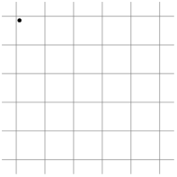

Here are some details on the grid subsampling algorithm used in our work.

The code is in utils/cutils/srcs/grid_subsampling.cpp.

All codes below are for illustration purposes and do not necessarily follow any specific rules.

### Preliminary



Given a point cloud, grid subsampling splits the space in non-overlapping grids and takes a random point from each grid.

Input:	

​	point cloud (xyz):	N x 3, float

​	grid size (gs):	float

Output:

​	selected indices:	M, int


### Naive hash-based implementation

Firstly, make sure all coordinates are non-negative.

```python
xyz = xyz - xyz.min(dim=0)
```

Then, push points into grids.

```python
for idx in range(len(xyz)):
	p = xyz[idx]
    # Discretization
    p = int(p / gs)
	key = p.x * step_x + p.y * step_y + p.z * step_z
    hash_table.insert(key, idx)
```

Here the hash table stores grids. i.e., a key retrieves a grid and a grid contains points (indices).

Step_xyz scatters grids in $[0,2^{64}-1]$. Keys are mapped to slots in the table.

Lastly, randomly select an index from each grid.

```python
indices = []
for grid in hash_table.values():
    idx = randrange(0, len(grid))
    indices.append(grid[idx])
```


We address 3 performance bottlenecks of this implementation.

+ Storing grids slows down insertion.
+ Cache miss.
+ Hash collision.


### Running selection

Instead of storing grids and selecting indices after all points have been processed, we store indices and select during the process.

The solution is to generate weights for all points and select the one with the largest weight.

```python
weight = randint()
hash_table.insert(key, idx, weight)
```

```python
indices = []
for idx, weight in hash_table.values():
    indices.append(idx)
```

However, random number generation is a heavy operation. Theoretically to select one point, we need only one random number.

We can extend a random number into a list of numbers with linear congruence.

```python
weight_0 = randint()
weight_1 = (weight_0 * a + b) % c
weight_2 = (weight_1 * a + b) % c
```

c is normally $2^{32}$ or $2^{64}$ .

With good choices of a and b, points from all locations have equal chances of getting selected.

Note it is not a cheaper random generator, but a cheap way of extending a number into a list. The quality of stochasticity is solely determined by the first weight's generator.

We simply want to use one single random number to select a point from a list of points with unspecified length.


### Fast-slow hash

Because the step sizes (step_xyz) are largely set to uniformly scatter points (in $[0,2^{64}-1]$) and reduce collision rate, cache helps little.

A solution is to first send points into a small hash table that can be packed into cache.

We observe that points adjacent in storage also tend to be spatially adjacent, thereby increasing the likelihood of them being in the same grid and processed in cache. (for S3DIS at least)

Additionally, the fast hash table can have a length that's a power of 2, reducing the cost of modular calculation (which maps a key to a slot).


### Dynamic step sizes

To reduce collision rate, we set step sizes dynamically according to the sizes of hash tables.

```python
step_x = 1 << 42;
step_x = step_x // slow_hash_size * slow_hash_size + int(slow_hash_size * slow_remainder_x)
step_x = step_x // fast_hash_size * fast_hash_size + fast_remainder_x;
```

Each step travels predefined distance (remainder).

We recommend tuning these parameters for different data distributions.


### Testing

During testing, to pick a specific point (the first in all grids for example), only the slow hash is used.
